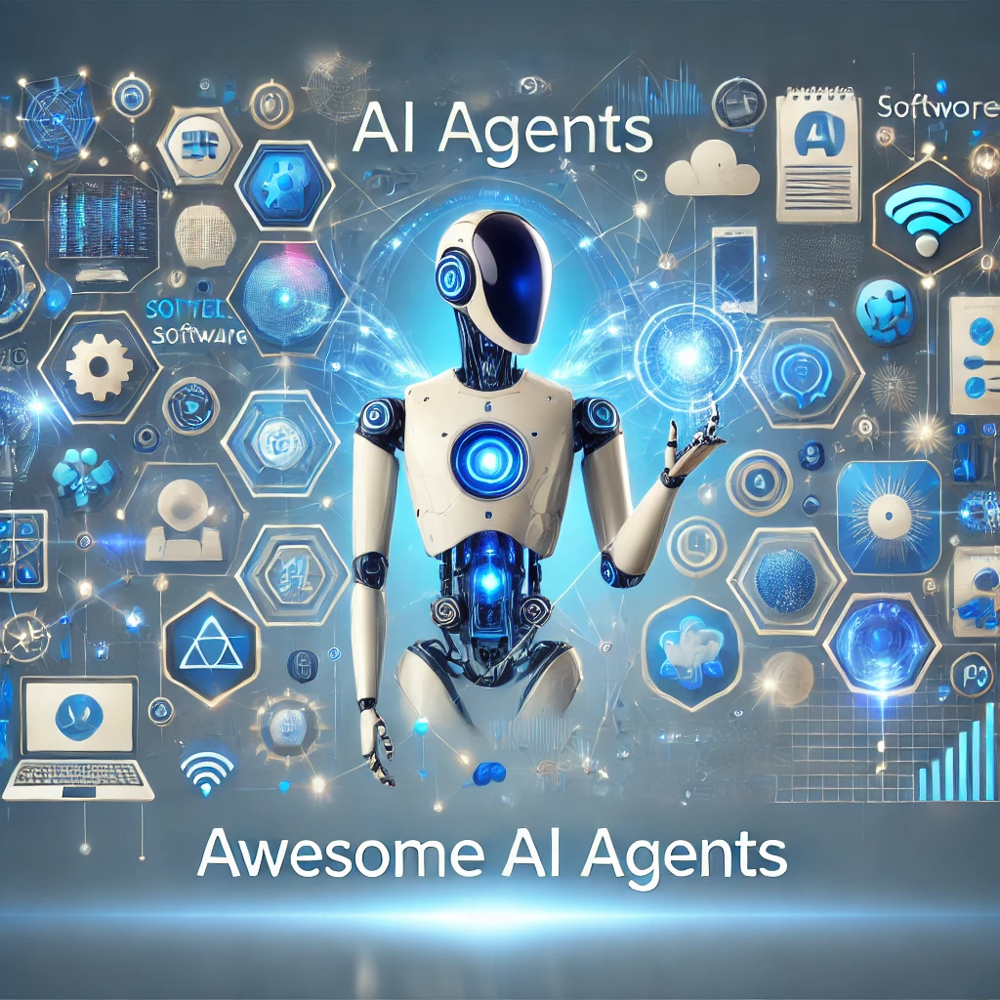

<!-- title -->

<!--lint ignore no-dead-urls-->

# Awesome AI Agents  

<!-- description -->

*A curated list of frameworks, tools, and resources for building and deploying AI agents. From multi-agent systems to autonomous coding assistants, this repository covers the latest advancements in AI agent technology.*

<!-- image -->

---

## Contents

- [Core Frameworks](#core-frameworks)
- [Specialized Agents](#specialized-agents)
    - [Coding Agents](#coding-agents)
    - [Research Agents](#research-agents)
    - [Creative Agents](#creative-agents)
- [Agent Operations](#agent-operations)
    - [Memory](#memory)
    - [Evaluation](#evaluation)
    - [Deployment](#deployment)
- [Research & Benchmarks](#research--benchmarks)
    - [Papers](#papers)
    - [Benchmarks](#benchmarks)
- [Community Resources](#community-resources)
    - [Communities](#communities)
    - [Newsletters](#newsletters)

---

## Core Frameworks

Frameworks for building and managing AI agents.

| Framework                                                  | Stars                                                                | Key Features                                                         |
|------------------------------------------------------------|----------------------------------------------------------------------|----------------------------------------------------------------------|
| [AutoGen](https://github.com/microsoft/autogen)            |            | Multi-agent conversations, GPT-4 integration, customizable workflows |
| [MetaGPT](https://github.com/geekan/MetaGPT)               |               | Simulates software company workflows, role-based agents              |
| [CrewAI](https://github.com/joaomdmoura/crewai)            |           | Role-based agent orchestration, task delegation                      |
| [LangChain](https://github.com/langchain-ai/langchain)     |       | Tool integration, memory management, agent chaining                  |
| [SuperAGI](https://github.com/TransformerOptimus/SuperAGI) |  | Open-source AGI framework, multi-modal agents                        |
| [Upsonic](https://github.com/upsonic/upsonic)              |              | Reliability layer, model context protocol, task-oriented             |
| [AgentVerse](https://github.com/OpenBMB/AgentVerse)        |           | Multi-agent simulation environments for research                     |
| [ChatDev](https://github.com/OpenBMB/ChatDev)              |              | Collaborative agents for software development                        |
| [AGiXT](https://github.com/Josh-XT/AGiXT)                  |                | Advanced AI automation platform with adaptive memory                 |

---

## Specialized Agents

Agents designed for specific tasks or industries.

### Coding Agents

| Name                                                    | Stars                                                            | Description                                 |
|---------------------------------------------------------|------------------------------------------------------------------|---------------------------------------------|
| [SWE-agent](https://github.com/princeton-nlp/SWE-agent) |  | AI agent for software engineering tasks.    |
| [GPT Pilot](https://github.com/Pythagora-io/gpt-pilot)  |   | Assists in writing and debugging code.      |
| [OpenDevin](https://github.com/OpenDevin/OpenDevin)     |      | Open-source alternative for coding tasks.   |

### Research Agents

| Name                                                            | Stars                                                               | Description                                             |
|-----------------------------------------------------------------|---------------------------------------------------------------------|---------------------------------------------------------|
| [GPT Researcher](https://github.com/assafelovic/gpt-researcher) |  | Autonomous agent for comprehensive online research.     |
| [Storm](https://github.com/stanford-oval/storm)                 |         | Multi-agent system for collaborative research.          |

### Creative Agents

| Name                                                   | Stars                                                        | Description                                       |
|--------------------------------------------------------|--------------------------------------------------------------|---------------------------------------------------|
| [ShortGPT](https://github.com/RayVentura/ShortGPT)     |  | AI agent for generating short-form video content. |
| [AI-town](https://github.com/a16z-infra/ai-town)       |   | Virtual world populated by AI agents.             |

---

## Agent Operations

Tools and systems for managing AI agents.

### Memory

| Name                                              | Stars                                                       | Description                                   |
|---------------------------------------------------|-------------------------------------------------------------|-----------------------------------------------|
| [MemGPT](https://github.com/cpacker/MemGPT)       |      | Manages memory for LLM-based agents.          |
| [ChromaDB](https://github.com/chroma-core/chroma) |  | Vector database for agent memory and context. |
| [Weaviate](https://github.com/weaviate/weaviate)  |   | Scalable vector database for agent memory.    |

### Evaluation

| Name                                                            | Stars                                                             | Description                                        |
|-----------------------------------------------------------------|-------------------------------------------------------------------|----------------------------------------------------|
| [AgentBench](https://github.com/THUDM/AgentBench)               |          | Multi-environment testing framework for AI agents. |
| [LangTrace](https://github.com/Scale3-Labs/langtrace)           |     | Monitoring and evaluation for agent workflows.     |
| [Agent Evaluation](https://github.com/awslabs/agent-evaluation) |  | Benchmark for evaluating agent capabilities.       |

### Deployment

| Name                                                       | Stars                                                                | Description                                      |
|------------------------------------------------------------|----------------------------------------------------------------------|--------------------------------------------------|
| [SuperAGI](https://github.com/TransformerOptimus/SuperAGI) |  | Deployment platform for autonomous agents.       |
| [OctoAI](https://github.com/octoai/octoAI)                 |                | Scalable infrastructure for AI agent deployment. |
| [Modal](https://github.com/modal-labs/modal-client)        |      | Serverless platform for deploying AI agents.     |

---

## Research & Benchmarks

Key research papers, benchmarks, and surveys on AI agents.

### Papers

| Title                                | Link                                      | Description                                      |
|--------------------------------------|-------------------------------------------|--------------------------------------------------|
| The Rise of LLM-Based Agents         | [arXiv](https://arxiv.org/abs/2309.07864) | Comprehensive survey on LLM-based agents.        |
| Tool Learning with Foundation Models | [arXiv](https://arxiv.org/abs/2304.08354) | Explores tool usage in AI agents.                |
| Multi-Agent Collaboration            | [arXiv](https://arxiv.org/abs/2308.08262) | Framework for collaborative multi-agent systems. |

### Benchmarks

| Name                                                            | Stars                                                             | Description                                   |
|-----------------------------------------------------------------|-------------------------------------------------------------------|-----------------------------------------------|
| [AgentBench](https://github.com/THUDM/AgentBench)               |          | Evaluates agents across diverse environments. |
| [ToolBench](https://github.com/OpenBMB/ToolBench)               |         | Benchmark for tool learning in agents.        |
| [Agent Evaluation](https://github.com/awslabs/agent-evaluation) |  | Benchmark for evaluating agent capabilities.  |

---

## Community Resources

Join the conversation and stay updated on AI agent developments.

### Communities

| Name                         | Link                                   | Description                                   |
|------------------------------|----------------------------------------|-----------------------------------------------|
| AI Agent Discord Communities | [Join](https://discord.gg/aicommunity) | Join discussions on AI agent frameworks.      |
| Agentic AI Meetups           | [Join](https://meetup.com/agentic-ai)  | Attend local or virtual meetups.              |
| LangChain Community          | [Join](https://discord.gg/langchain)   | Active community for LangChain and AI agents. |

### Newsletters

| Name                 | Link                                     | Description                                           |
|----------------------|------------------------------------------|-------------------------------------------------------|
| AI Agent Weekly      | [Subscribe](https://aiagentweekly.com)   | Weekly roundup of AI agent news and updates.          |
| The Agentic Observer | [Subscribe](https://agenticobserver.com) | Monthly deep dives into AI agent research and trends. |

---

## Contributing

Your contributions are welcome! Here’s how to get started:

1. **Fork the repository** and clone it locally.
2. Add your resource to the appropriate section in `README.md`.
3. Ensure the resource is:
    - Relevant to AI agents.
    - Actively maintained (updated within the last 6 months).
    - Includes a brief description and link.
4. Submit a pull request with a clear description of your changes.

For more details, see the [CONTRIBUTING.md](docs/CONTRIBUTING.md) guide.

---

## License

This project is licensed under the [MIT License](LICENSE). Feel free to use, modify, and distribute it as needed.

---

**Star this repository** to show your support and stay updated on the latest AI agent resources!
